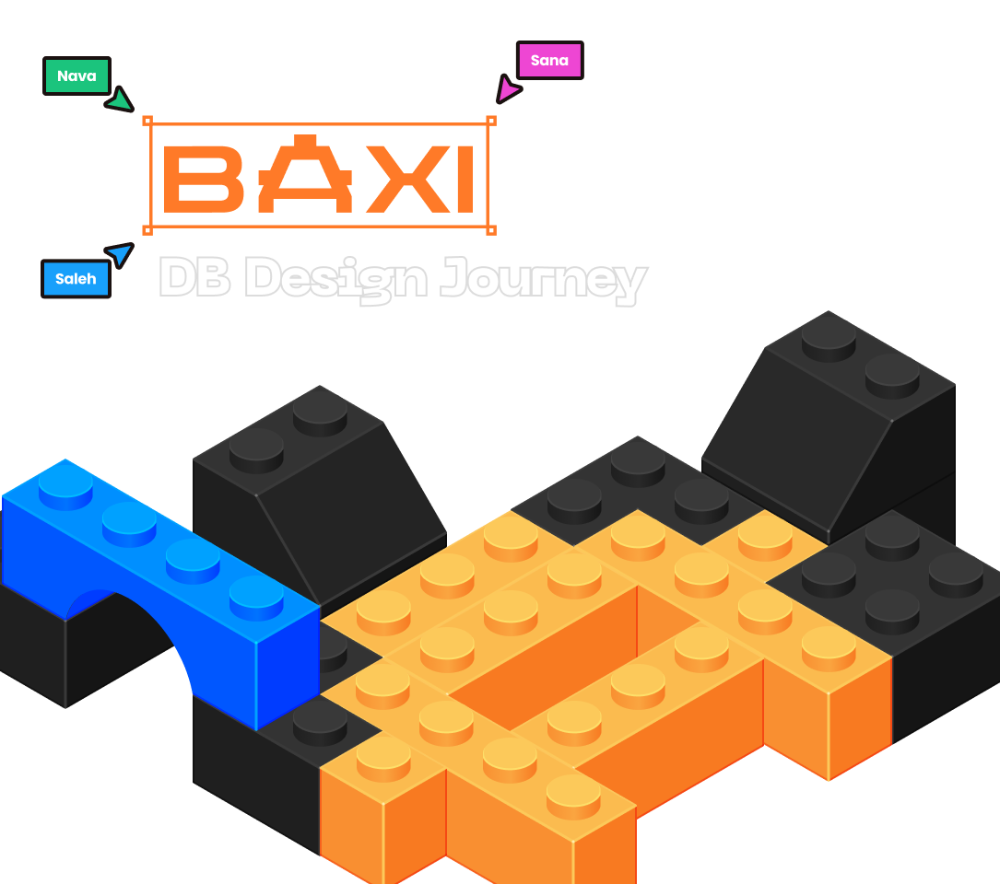
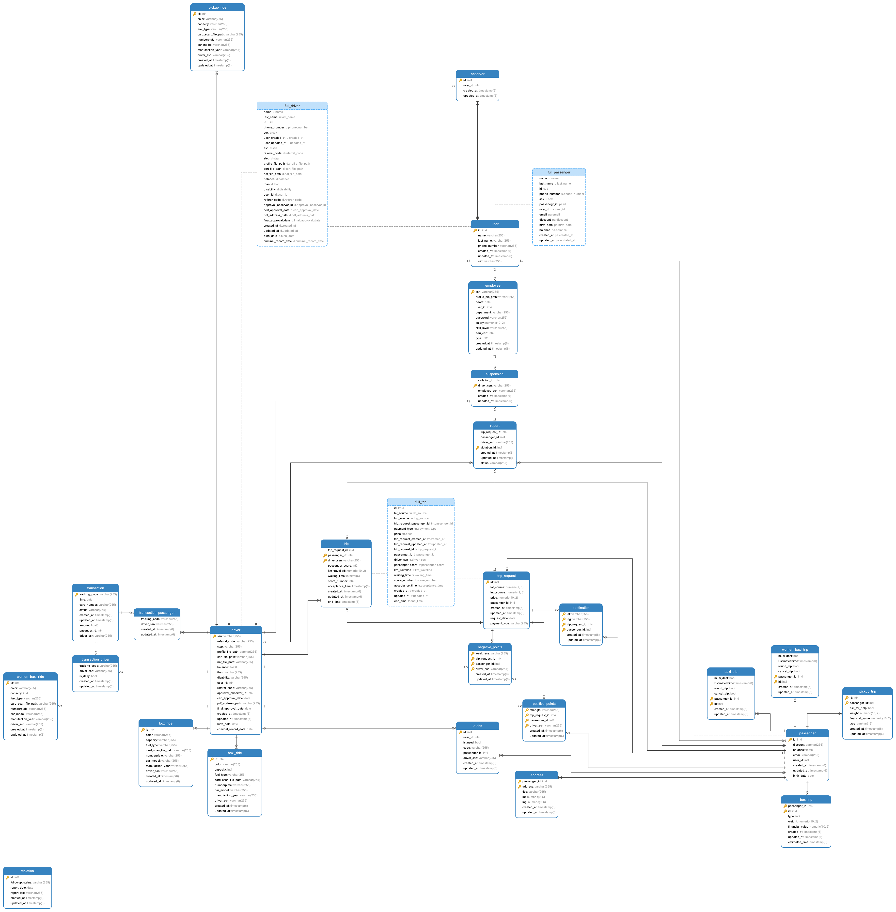
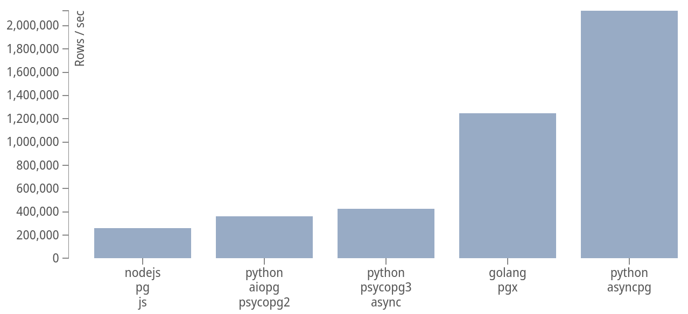
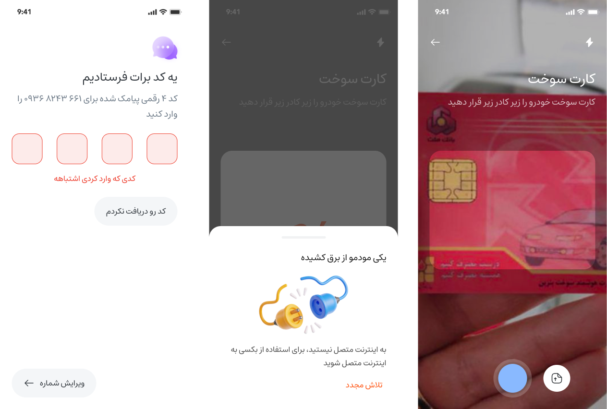
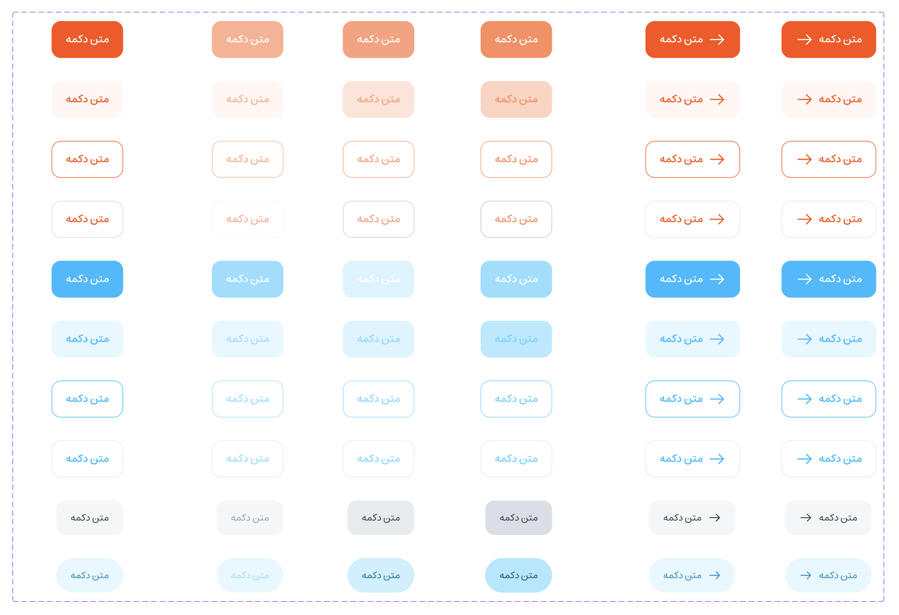
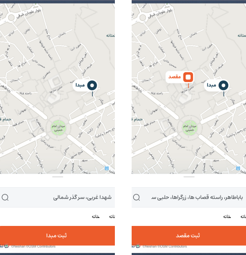

    

# Baxi

## Table of Contents
1. [Introduction](#introduction)
2. [Technologies](#technologies)
3. [Database Design](#database-design)
4. [Why PostgreSQL & AsyncPG?](#why-postgresql--asyncpg)
5. [Why FastAPI & UVLoop?](#why-fastapi--uvloop)
6. [Why Redis?](#why-redis)
7. [Backend](#backend)
8. [Frontend](#frontend)
9. [How to Run With Docker](#how-to-run-docker)
10. [How to Run In Local](#how-to-run-in-local)

## Introduction
Baxi is an application that allows passengers to hail a ride and drivers to charge fares and get paid.
It uses Fastapi as the backend framework and React as the frontend framework. more specifically Baxi was a practice-to-practice system and database design, designing a DBMS as performant as possible and breaking an almost big project into smaller pieces and trying to handle them in a precise way so we precise database performance, extensibility, and maintainability, trying to proceed according to a framework to have a clean, scalable, re-usable architecture and code using design patterns helpful in working with databases. one more key factor that was crucial for us was security and protect our database, API and frontend code all in a same line against XSS, XSRF attacks and also using rate limiting trying to control traffic flow to the server by restricting the number of requests from vulnerable endpoints.

## Technologies

### Backend API

   &emsp; 
    
  &emsp; 
    
  &emsp; 
    
  &emsp; 
    
  &emsp; 
    

### DBMS

  &emsp; 
    
  &emsp; 
    

### Front-End

 
  &emsp; 
    
  </a>
    &emsp; 
    
        &emsp; 
            

### Design, Motions & Animations

 
      &emsp;
        
  &emsp; 
    
  &emsp; 
    

## Database Design
we started by Defining our needs, analyzing system design and requirements, and breaking them into smaller pieces, a big epic into smaller so-called Entities, and using this to model the relations between entities and have a more efficient, premeditated database design. converting this model we can model our statement using tables.

## Why PostgreSQL & AsyncPG?
why did we choose PostgreSQL among all Relational DBMSs out there?
We needed high performance, low latency and additional features of PostgreSQL itself.
leveraging the PostgreSQL protocol directly Our prior encounter with uvloop demonstrated

> the capability of creating efficient and effective libraries using Cython. asyncpg is entirely crafted in Cython, integrating advanced memory management and optimization techniques. Consequently, asyncpg demonstrated an average speed enhancement of 3 times compared to psycopg2 (or aiopg).

you can compare the AsyncPG driver benchmark by [Magic Stack]([#why-fastapi-&-asyncpg?](https://www.google.com/url?sa=i&url=https%3A%2F%2Fgithub.com%2FMagicStack%2Fasyncpg&psig=AOvVaw3o0kzOn9-m7S1DhbDNbumH&ust=1710244836997000&source=images&cd=vfe&opi=89978449&ved=0CBUQjhxqFwoTCKj1htKU7IQDFQAAAAAdAAAAABAE)) in the chart below:

 

## Why FastAPI & UVLoop?

> uvloop is a fast, drop-in replacement of the built-in asyncio event loop. It is implemented in Cython

considering different use cases in our project, working with database, let's compare it with other frameworks out there including nodejs and golang and mention fast api advantages and disadvantages over other frameworks:

### FastAPI's Performance in Comparison with Golang Gin, NestJS and ExpressJS

(I found these on the issues page of the official FastAPI repository)
> Gin is a web framework written in Golang. It features a Martini-like API, but with performance up to 40 times faster than Martini. If you need performance and productivity, you will love Gin.

> When considering FastAPI's performance in various scenarios compared to NestJS and ExpressJS, it's important to note that the choice of framework ultimately depends on specific use cases and workload requirements. Here's a brief overview of the findings based on TechEmpower's Round 19 benchmarks:

> - **Plain Text**: If the primary workload involves serving text, Golang is a perfect choice rather than fast api. FastAPI lags behind NestJS and ExpressJS in this scenario.

> - **Data Updates**: FastAPI excels in scenarios where requests involve fetching data from a database, updating it, and returning the results. It outperforms NestJS and ExpressJS in this area.

> - **Multiple Queries**: FastAPI performs slightly better than Gin when it comes to fetching multiple rows from a database and serializing the results. ExpressJS and NestJS lag behind in this scenario.

> - **Single Query**: For scenarios involving fetching and serializing a single row, Gin leads the pack, followed by FastAPI, NestJS, and ExpressJS in that order.

> - **JSON Serialization**: In tests focusing on JSON serialization without database activity, Gin outperforms the competition, with ExpressJS, NestJS, and FastAPI following suit.

In summary, FastAPI is a good choice in dealing with large amounts of data from a database, performing at a fast speed in such cases. However, its performance may vary in scenarios with less database activity and io operations which is related to async operations on the event loop, where Gin tends to be a better choice.

## Why Redis?
- **To handle OTP Expiration:** We use OTP-Based Authentication in our application, so we need to check the OTP code. OTP codes have a limited expiration time and if we store OTP codes also in our relational PostgreSQL database it would massively decrease our performance and it takes up a lot of RAM usage.
  🤔 but what if use a fast temporary dbms as a cache? which handles the expiration time itself and whenever the expiration comes destructs himself. well say hello to Redis.
- **To manage Tokens:** If we want to implement a revoke button for the user so whenever he needs to log out from his session, he can see, and manage the active sessions and revoke any of them if they sound malicious.. so it's necessary to have access to tokens besides their expiration date.

## Backend
The **backend** of Baxi is developed in Python Fast API, why Fast API? you might ask. well according to our needs and project, I explored different frameworks, and libraries such as Nodejs, Python Flask or Django, and several other platforms besides several database drivers available in 2024 and I came to realize Fast API Async PG is the fastest choice I can make. according to what we discussed about in [Why Fast API & AsyncPG?](#why-fastapi-&-asyncpg?)

other key factors made Fast API the best choice we could have for our application, its framework providing high-performance Nodejs and Golang coming along with Python. and it was fun

we focused on a limited number of statements but tried to deeply dive into each one's best practices used by other developers in the community:
- **Authentication (Auth):** Manages user registration, verification, and login protecting against XSS-XSRF attacks using tokens:
    -  **Security:** Using rfc7519 standards, JWT tokens, rate limiting
    -  **Cache Radis:** Storing OTP Verification in Redis
    -  **Revoking Tokens:** Storing Access Tokens in Redis to have access to them, revoke tokens
    -  **Validation & Sanitizing:** Validating and sanitizing user input using Pydantic
    -  **Secure Tokens:** Providing and receiving tokens in the secure layers, HTTP only tookies and safe headers

here are our best practices for trying to have a maintainable code:
- **Repository Design Pattern:** Using Repository Design Patterns and data sources for a flexible design
- **DI Design Pattern:** Using Dependency Injection Design Pattern to have a dynamic and flexible depending

The backend leverages cutting-edge technologies like Docker, SQLAlchemy, AsyncPG, and Redis to provide a solid foundation for an online taxi platform.

For detailed documentation on the backend components and how to set up and run the backend system, please refer to the Backend Repository

## Frontend

Completing Our Puzzle pieces started with the Backend, we needed access to API anywhere in the application, working with maps and handling authentication and private (authentication required) so we explored best practices for implementing frontend code and having a cleaner and more scalable code so we used these methods and React.js libraries:
- **Authentication Provider:** a provider for authentication required routes from react-router, storing and accessing auth tokens safe, easy, flexible, and secure
- **Private Axios Hook:** an instance of Axios for sending API requests to authentication-required endpoints wrapping the requests in secure cookies and sending the credentials:
    -  **Request Interceptor:** Using request interceptors we simplified our work in working with sending auth-required requests and including credentials just once and using it everywhere:)
    -  **Response Interceptor:** Using response interceptors we minified our work in working with auth-required routes, and pages and accessing tokens easily

- **Design System and Components:** Implementing our UI Design, We Started with designing Our Design System based on atomic design (regarding Brad Frost) and making our process of developing front-end, changing or editing UI components or logic later on, easier and more integrated code. Our Design system is not complete yet but it does have a good start.
    -  **Buttons:** We have `primary` `secondary` `tonal` `outline` `text` buttons as an example with one single component, a typography system, and a responsive grid.
    -  **Inputs:** We applied padding, spacing, typeface, corner radius, and several states of inputs into our input component simplifying our job
    -  **Modal Providers:** We needed to show models such as no network modal anywhere inside our application, so we used react context API and simply wrapped our application and routers inside it
    -  **Map View:** We used OpenLayers Map and to be honest it was such a low-level library that we had to define and implement each interaction with user touch or mouse cursor change events, for the location picker from the experience users have from other e-taxi services we had to implement each interaction and listen to event listeners to change the location and modification of the marker.

      

## How to Run Docker
To get Baxi up and running in a docker container, follow these steps:

1. **Clone the Repository:** `git clone https://github.com/salehsoleimani/baxi-e-taxi`
2. **Cd into the Backend Directory:** `cd baxi-API/`
3. **Build the Backend Docker Image:** `Make build`
4. **Run the Backend Docker Container:** `Make run`
5. **Cd into the Frontend Directory:** `cd ../baxi-client`
6. **Build the Frontend Docker Image:** `Make build`
7. **Cd into the root Directory:** `cd ../`
8. **Running it all at once:** `docker-compose -f docker-compose.yml up`

> [!NOTE]  
> Modify the application environment variables in the `docker-compose.yml` file before you run the application

## How to Run in Local
To get Baxi up and running in your local environment, follow these steps:

1. **Clone the Repository:** `git clone https://github.com/salehsoleimani/baxi-e-taxi`
2. **Cd into the Backend Directory:** `cd baxi-API/`
3. **Create a python Venv:** `python3 -m venv .venv`
4. **Initialize baxi venv:** `source .venv/bin/activate`
5. **Install The requirements:** `python3 -m pip install -r requirements.txt`
6. **Serve the application using uvicorn and setting event loop work:** `uvicorn main:app --host 0.0.0.0 --port 4000 --reload --loop uvloop --workers 1`
8. **Cd into the Frontend Directory:** `cd ../baxi-client`
9. **Run or Build the Client Server:** `npm start`

Note: for dependencies to work you need to set up the event loop and worker threads manually by the 6th command

You can now access the backend server at port 4000 and the frontend side at port 3000
